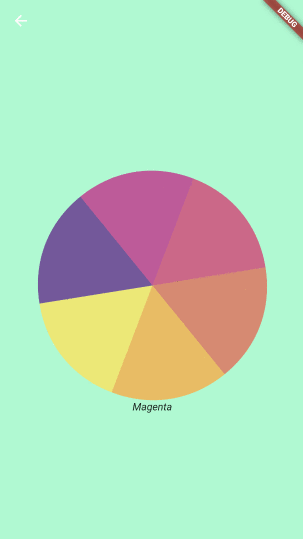
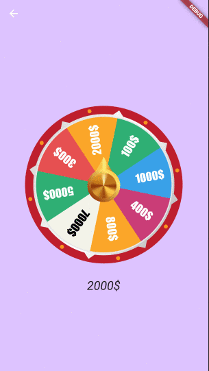

# flutter_spinning_wheel

[](https://travis-ci.com/davidanaya/flutter-spinning-wheel) [](https://opensource.org/licenses/MIT) [](https://pub.dartlang.org/packages/flutter_spinning_wheel)

A customizable widget to use as a spinning wheel in Flutter.

## Getting Started

- [Installation](#installation)
- [Basic Usage](#basic-usage)
- [Constructor](#constructor)
- [Use Cases](#use-cases)

### Installation

Add

```bash

flutter_spinning_wheel : ^lastest_version

```

to your pubspec.yaml, and run

```bash
flutter packages get
```

in your project's root directory.

### Basic Usage

Create a new project with command

```
flutter create myapp
```

Edit lib/main.dart like this:

```dart
import 'package:flutter/material.dart';

import 'package:flutter_circular_slider/flutter_circular_slider.dart';

void main() => runApp(MyApp());

class MyApp extends StatelessWidget {
  @override
  Widget build(BuildContext context) {
    return MaterialApp(
      theme: ThemeData(
        primarySwatch: Colors.blue,
      ),
      home: MyHomePage(),
    );
  }
}

class MyHomePage extends StatelessWidget {
  @override
  Widget build(BuildContext context) {
    return Scaffold(
        backgroundColor: Colors.blueGrey,
        body: Center(
          child: Container(child:
            SpinningWheel(
              Image.asset('assets/images/wheel-6-300.png'),
              width: 310,
              height: 310,
              dividers: 6,
              onEnd: _dividerController.add,
            ),
          ),
        ));
  }
}
```

You can replace the image with one of your preference.

|                 Basic                 |                Game                 |
| :-----------------------------------: | :---------------------------------: |
|  |  |

### Constructor

| Parameter                |         Default          | Description                                                                                           |
| :----------------------- | :----------------------: | :---------------------------------------------------------------------------------------------------- |
| image                    |                          | The image to be used as wheel.                                                                        |
| dividers                 |                          | The number of divisions in the image. It's important that all divisions are equal.                    |
| height                   |                          | Height of the container that will display the wheel.                                                  |
| width                    |                          | Width of the container that will display the wheel.                                                   |
| initialSpinAngle         |           0.0            | Initial rotation angle for the wheel, so the wheel could look initialy rotated.                       |
| spinResistance           |           0.5            | From >0.0 to 1.0 will be used to calculate the speed and deceleration of the wheel.                   |
| canInteractWhileSpinning |           true           | If set to false, once the animation starts the user won't be able to stop it.                         |
| secondaryImage           |                          | Secondary image that will be rendered on top of the wheel and won't be affected by the animation.     |
| secondaryImageHeight     |                          | Height for the secondary image.                                                                       |
| secondaryImageWidth      |                          | Width for the secondary image.                                                                        |
| secondaryImageTop        |                          | Used to fine tune the position of the secondary image. Otherwise it will be centered.                 |
| secondaryImageLeft       |                          | Used to fine tune the position of the secondary image. Otherwise it will be centered.                 |
| onUpdate                 | void onUpdate(int value) | Callback function executed when the selected divider changes during the animation.                    |
| onEnd                    |  void onEnd(int value)   | Callback function executed when the animation stops.                                                  |
| shouldStartOrStop        |                          | Stream<double> to interact with the wheel, with double being pixelsPerSecond in axis y (default 8000) |

### Use Cases

#### Game

```dart
import 'dart:async';
import 'dart:math';

import 'package:flutter/material.dart';
import 'package:flutter/services.dart';
import 'package:flutter_spinning_wheel/flutter_spinning_wheel.dart';

void main() {
  SystemChrome.setEnabledSystemUIOverlays([]);
  runApp(MyApp());
}

class MyApp extends StatelessWidget {
  @override
  Widget build(BuildContext context) {
    return MaterialApp(
      theme: ThemeData(
        primarySwatch: Colors.blue,
      ),
      home: MyHomePage(),
    );
  }
}

class MyHomePage extends StatelessWidget {
  final StreamController _dividerController = StreamController<int>();

  dispose() {
    _dividerController.close();
  }

  @override
  Widget build(BuildContext context) {
    return Scaffold(
      appBar: AppBar(backgroundColor: Color(0xffDDC3FF), elevation: 0.0),
      backgroundColor: Color(0xffDDC3FF),
      body: Center(
        child: Column(
          mainAxisAlignment: MainAxisAlignment.center,
          children: [
            SpinningWheel(
              Image.asset('assets/images/roulette-8-300.png'),
              width: 310,
              height: 310,
              initialSpinAngle: _generateRandomAngle(),
              spinResistance: 0.6,
              canInteractWhileSpinning: false,
              dividers: 8,
              onUpdate: _dividerController.add,
              onEnd: _dividerController.add,
              secondaryImage:
                  Image.asset('assets/images/roulette-center-300.png'),
              secondaryImageHeight: 110,
              secondaryImageWidth: 110,
            ),
            SizedBox(height: 30),
            StreamBuilder(
              stream: _dividerController.stream,
              builder: (context, snapshot) =>
                  snapshot.hasData ? RouletteScore(snapshot.data) : Container(),
            )
          ],
        ),
      ),
    );
  }

  double _generateRandomAngle() => Random().nextDouble() * pi * 2;
}

class RouletteScore extends StatelessWidget {
  final int selected;

  final Map<int, String> labels = {
    1: '1000\$',
    2: '400\$',
    3: '800\$',
    4: '7000\$',
    5: '5000\$',
    6: '300\$',
    7: '2000\$',
    8: '100\$',
  };

  RouletteScore(this.selected);

  @override
  Widget build(BuildContext context) {
    return Text('${labels[selected]}',
        style: TextStyle(fontStyle: FontStyle.italic, fontSize: 24.0));
  }
}
```


